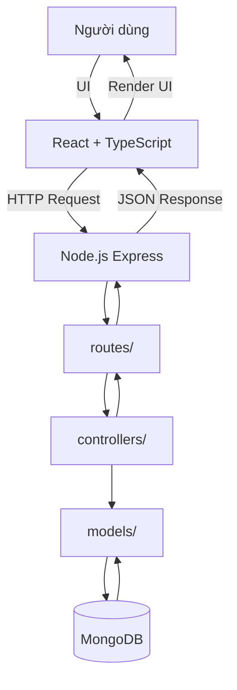

# 📌 Tech Task Friendly – Project Management Web App

Tech Task Friendly là ứng dụng quản lý dự án và công việc thân thiện, được xây dựng với **React + TypeScript (Frontend)** và **Node.js + Express (Backend)**. Ứng dụng hỗ trợ quản lý dự án, phân công công việc, theo dõi tiến độ, thông báo thời gian thực, và quản trị hệ thống.  

## 🚀 Tính năng chính

- **Quản lý tài khoản**: Đăng ký, đăng nhập, đổi mật khẩu, cập nhật hồ sơ.  
- **Quản lý dự án**: Tạo, chỉnh sửa, đóng/archived dự án; quản lý thành viên và phân quyền.  
- **Quản lý công việc (Task Management)**: Tạo, cập nhật, xóa, phân công, thay đổi trạng thái, bình luận, đính kèm file, log work.  
- **Thông báo (Notifications)**: Nhận thông báo qua Socket.io hoặc FCM, cấu hình cài đặt thông báo.  
- **Báo cáo (Reports)**: Xem và tạo báo cáo tiến độ dự án.  
- **Admin Dashboard**: Quản lý người dùng, audit logs, system reports.  

## 🏗️ Kiến trúc hệ thống

### Frontend (React + TypeScript)
- **pages/**: Dashboard, Login, Register, TaskList, TaskDetail, AddTask, ProjectPage, Profile, Notifications, Settings, Admin.  
- **providers/**: Auth, Project, Task, Notification, User, Settings, Admin.  
- **services/**: API service, Auth service, Notification service, File service.  
- **models/**: User, Project, Task, Notification, WorkUnit, Comment, Attachment, Admin.  

### Backend (Node.js + Express)
- **models/**: User, Project, Task, Notification, UserProject, WorkUnit, Comment, Attachment, AdminLog, Report.  
- **routes/**: auth.js, projects.js, tasks.js, users.js, notifications.js, admin.js, file.js.  
- **controllers/**: authController, projectController, taskController, userController, notificationController, adminController, fileController.  
- **server.js**: Khởi chạy server, kết nối MongoDB, đăng ký routes, middleware (JWT, audit log, Multer).  

### Database (MongoDB)
- **Entities**: User, Project, UserProject, WorkUnit, Task, Comment, Attachment, Notification, AdminLog, Report.  

---

## ⚙️ Công nghệ sử dụng

- **Frontend**: React + TypeScript, Context API/Provider, Axios/Fetch.  
- **Backend**: Node.js, Express.js, MongoDB, Mongoose, JWT, Socket.io, Multer.  
- **Dev Tools**: Vite, Nodemon, dotenv, cors.  

---

## 📂 Cài đặt và chạy dự án

### 1. Clone repository
```bash
git clone https://github.com/anlv6000/Tech-project-management-web.git
cd Tech-project-management-web
```

### 2. Cài đặt dependencies
- **Frontend**
```bash
cd frontend
npm install
```

- **Backend**
```bash
cd backend
npm install
```

### 3. Cấu hình môi trường
Tạo file `.env` trong thư mục `backend`:
```
PORT=5000
MONGO_URI=mongodb://localhost:27017/task_management
JWT_SECRET=your_secret_key
```

### 4. Chạy ứng dụng
- **Frontend**
```bash
npm run dev
```

- **Backend**
```bash
node server.js
```

---

## 📊 Sơ đồ kiến trúc



---

## 📌 Roadmap

- [ ] Tích hợp Firebase Cloud Messaging cho thông báo mobile.  
- [ ] Thêm tính năng Kanban board trực quan.  
- [ ] Xuất báo cáo PDF/Excel.  
- [ ] Triển khai CI/CD với GitHub Actions.  

---

## 👨‍💻 Đóng góp

1. Fork repo.  
2. Tạo branch mới (`git checkout -b feature/your-feature`).  
3. Commit thay đổi (`git commit -m 'Add new feature'`).  
4. Push branch (`git push origin feature/your-feature`).  
5. Tạo Pull Request.  

---

## 📜 License

MIT License – bạn có thể sử dụng, chỉnh sửa, và phân phối tự do.

---
